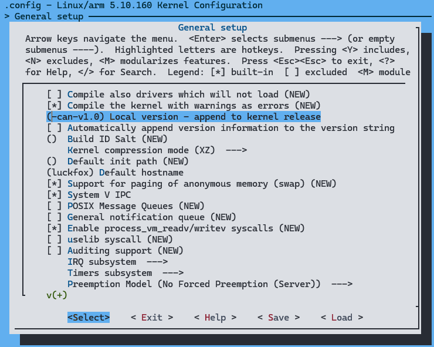
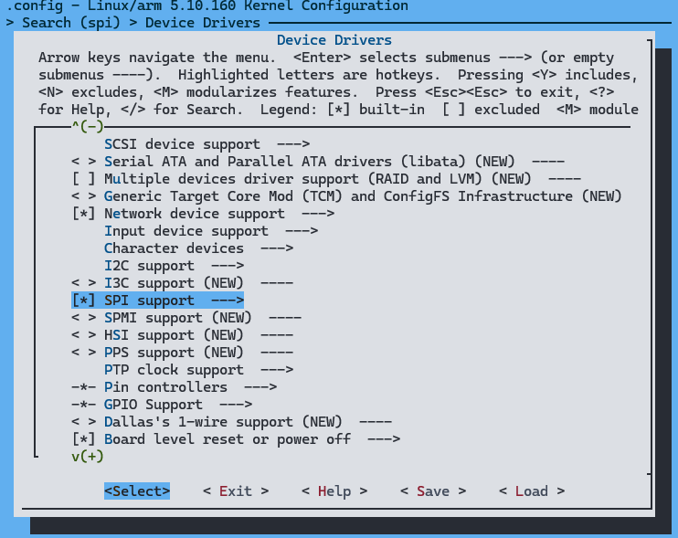
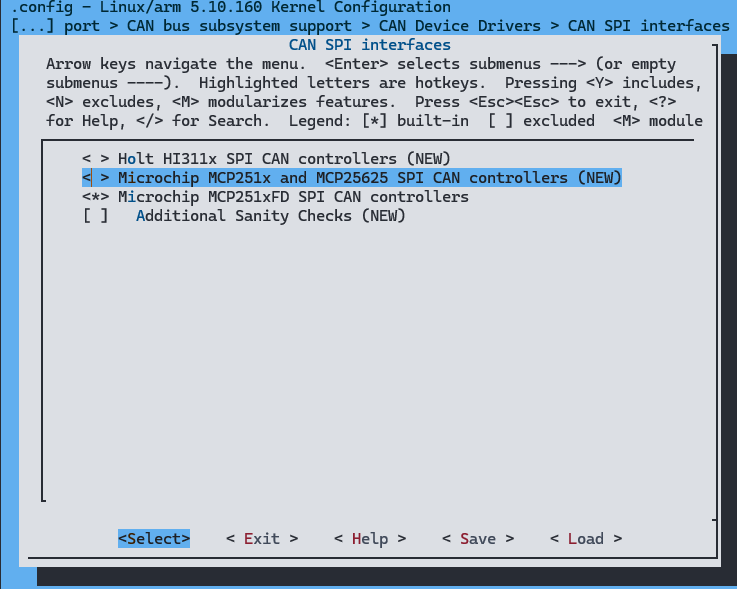
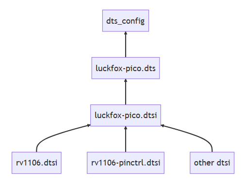
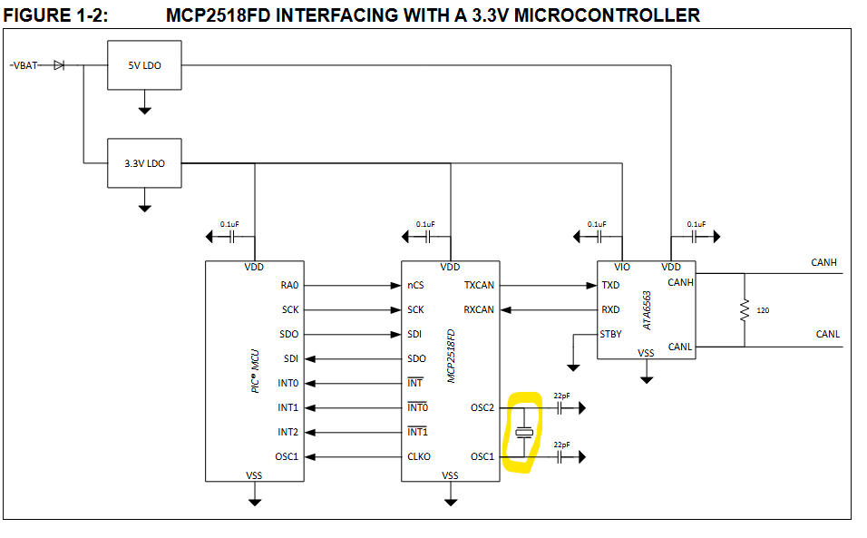
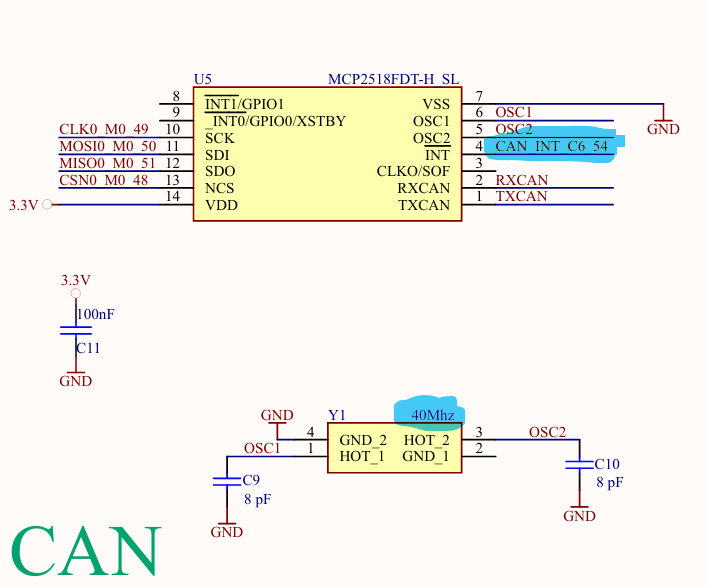

import Tabs from "@theme/Tabs";
import TabItem from "@theme/TabItem";

**Table of Contents:**
- [Lab setup](#lab-setup)
- [Buildroot](#buildroot)
  - [Add the packages in buildroot](#add-the-packages-in-buildroot)
- [Kernel config](#kernel-config)
  - [Configuring the Kernel](#configuring-the-kernel)
  - [Device Tree](#device-tree)
    - [1. Modify the `dts`](#1-modify-the-dts)
    - [2. Modify the `.dtsi`](#2-modify-the-dtsi)
- [Final preparation](#final-preparation)
- [End Result](#end-result)
- [References](#references)

{/* truncate */}

## Lab setup

The SBC *luckfox-pico-ultra* is mounted on a custom made motherboard with some external peripherals such as can bus and isolated rs-485  
  
SBC: [Luckfox Pico Ultra W rv1106g 8GB](https://www.luckfox.com/Luckfox-Pico/EN-Luckfox-Pico-Ultra)  
Custom motherboard: [schematics](./assets/custom-motherboard.pdf)

I am using the containerized Luckfox SDK docker image `luckfoxtech/luckfox_pico:1.0` for build environment.
As image flashing tool: `SOC Toolkit` for Windows. The whole system image flashing procedure is well documented in the [official wiki](https://wiki.luckfox.com/Luckfox-Pico-Ultra/Flash-image)

## Buildroot 

### Add the packages in buildroot

<Tabs>
  <TabItem value="1. can-utils">
  **can-utils** includes `candump`, `cansend`, `cansniffer` etc  

    <div style={{ width: "100" }}></div>
  </TabItem>
  <TabItem value="2. iproute2">
  **iproute2** is the Linux networking toolkit that replaced net-tools (ifconfig, route, arp etc.)  
    [iproute2 cheatsheet](https://paulgorman.org/technical/linux-iproute2-cheatsheet.html)  

    <div style={{ width: "80" }}></div>
  </TabItem>
</Tabs>

## Kernel config

### Configuring the Kernel 
<Tabs>
  <TabItem value="1. Set a local version">
  It is good to set the kernel a local version name, so you can later check what is the kernel image on the SBC with `uname` 
  ```
  General Setup --->
   ()Local version - append to kernel release
  ```
    <div style={{ width: "100" }}></div>
  </TabItem>
  <TabItem value="2. Enable the SPI">
 ```
 Device Drivers --->
   [*] SPI support
 ```
    <div style={{ width: "100" }}></div>
  It is also helpful to enable the Debug support for SPI drivers, one menu deep inside SPI support
  </TabItem>
  <TabItem value="3. Enable CAN-SPI driver">
  ```
    Networking support --->  
     CAN bus subsystem support --->  
      CAN Device Drivers --->  
       CAN SPI interfaces --->
        <*> Microchip MCP251xFD SPI CAN controllers
  ```
    <div style={{ width: "50" }}></div>
    <div style={{ width: "100" }}></div>
  </TabItem>
</Tabs>

### Device Tree

According to Luckfox:  

> For Luckfox Pico, the basic device tree configurations related to the RV1103 / RV1106 chips—such as rv1106.dtsi, rv1106-pinctrl.dtsi, etc.—are provided by Rockchip. Based on the hardware resources available on the Luckfox Pico, the default configurations are set in .dtsi files, while model-specific hardware information is defined in .dts files.
> * The configurations in .dts files have the highest priority and can override settings in the .dtsi files. You can reference nodes from .dtsi and either modify their properties or recreate them entirely.
> * For easier editing, the .dts file corresponding to the selected board support package is symlinked to `<luckfox-pico SDK>/config/dts_config` after running ./build.sh. Normally, you only need to edit the .dts file to configure hardware features—.dtsi files should not be modified.
> 
> 

The `dts` files are located under `<SDK-folder>/sysdrv/source/kernel/arch/arm/boot/dts` the ones that we need are named as follows: 
|sbc|.dts|.dtsi|
|:-:|:-:|:-:|
|Luckfox Pico ultra W|rv1106g-luckfox-pico-ultra-w.dts|rv1106-luckfox-pico-ultra-ipc.dtsi|

[(check here for others)](https://wiki.luckfox.com/Luckfox-Pico-Ultra/Device-Tree)

 #### 1. Modify the `dts`

In the `.dts` file you can see that I have removed a lot of things for the sake of simplicity and the lab itself (running the CAN). The missing parts are mainly regarding the `BT` and `SDIO-WIFI` 

 - modified: [rv1106g-luckfox-pico-ultra-w.dts](./assets/rv1106g-luckfox-pico-ultra-w-modified.dts)
 - original: [rv1106g-luckfox-pico-ultra-w.dts](./assets/rv1106g-luckfox-pico-ultra-w.dts)

<Tabs>
  <TabItem value="1. Modified dts">
    ```C title="rv1106g-luckfox-pico-ultra-w.dts"
    // SPDX-License-Identifier: (GPL-2.0+ OR MIT)
    /*
    * Copyright (c) 2022 Rockchip Electronics Co., Ltd.
    */

    /dts-v1/;
    #include "rv1106.dtsi"
    #include "rv1106-luckfox-pico-ultra-ipc.dtsi"
    #include <dt-bindings/input/input.h>
    #include <dt-bindings/display/media-bus-format.h>

    / {
            ***>
            clk_mcp251xfd: clk_mcp251xfd {
                    compatible = "fixed-clock";
                    #clock-cells = <0>;
                    clock-frequency = <40000000>;
            };
            ***<
    };
    ***>
    /**********SPI**********/
    &spi0 {
            status = "okay";
            pinctrl-0 = <&spi0m0_clk &spi0m0_miso &spi0m0_mosi &spi0m0_cs0>;
            #address-cells = <1>;
            #size-cells = <0>;
            spidev@0 {
                    status = "okay";
                    compatible = "microchip,mcp251xfd";
                    reg = <0>;
                    spi-max-frequency = <4000000>;
                    interrupts = <RK_PC6 IRQ_TYPE_LEVEL_LOW>;
                    interrupt-parent = <&gpio1>;
                    clocks = <&clk_mcp251xfd>;
                    clock-names = "mcp251xfd";
                    vdd-supply = <&vcc_3v3>;
                    xceiver-supply = <&vcc_3v3>;
            };
    };
    ***<
    ```
  </TabItem>
  <TabItem value="2. clock frequency">
  here the `clock-frequency` must be the equal to the oscillator of the board used e.g. if the oscillator is 20MHz it should be 20000000 in our case we use 40MHz, otherwise it just won't work
  ```C  title="rv1106g-luckfox-pico-ultra-w.dts"
  ***>
  clk_mcp251xfd: clk_mcp251xfd {
                compatible = "fixed-clock";
                #clock-cells = <0>;
                clock-frequency = <40000000>;
        };
  ***<
  ```
  <div style={{ width: "100" }}></div>
  </TabItem>

  <TabItem value="3. interrupts">
  As pin for the interrupt we are using C6 from the luckfox board which should be configured as interrupt Input pin active on Low level
  ```C  title="rv1106g-luckfox-pico-ultra-w.dts"
***>
/**********SPI**********/
&spi0 {
        status = "okay";
        pinctrl-0 = <&spi0m0_clk &spi0m0_miso &spi0m0_mosi &spi0m0_cs0>;
        #address-cells = <1>;
        #size-cells = <0>;
        spidev@0 {
                status = "okay";
                compatible = "microchip,mcp251xfd";
                reg = <0>;
                spi-max-frequency = <4000000>;
                interrupts = <RK_PC6 IRQ_TYPE_LEVEL_LOW>;
                interrupt-parent = <&gpio1>;
                clocks = <&clk_mcp251xfd>;
                clock-names = "mcp251xfd";
                vdd-supply = <&vcc_3v3>;
                xceiver-supply = <&vcc_3v3>;
        };
};
***<
  ```
  <div style={{ width: "100" }}></div>
  <div style={{ width: "100" }}></div>
  </TabItem>
</Tabs>


#### 2. Modify the `.dtsi`

Here I have removed `CSI`, `LCD/TP` and the things related to the RGB, 
because some pins are needed for interrupt of the `mcp2518fd` chip.  

You can compare them to see the full changes e.g. with WinMerge:
   - modified `.dtsi` : [rv1106-luckfox-pico-ultra-ipc.dtsi](./assets/rv1106-luckfox-pico-ultra-ipc-modified.dtsi)  
   - original `.dtsi` : [rv1106-luckfox-pico-ultra-ipc.dtsi](./assets/rv1106-luckfox-pico-ultra-ipc.dtsi)
:::note
The configurations in .dts files have the highest priority and can override settings in the .dtsi files, so
the `clk_mcp2515` in the root node  and `&spi0` are overwrited by the dts so their prop values are not applied. 
:::
<Tabs>
  <TabItem value="Modified dts">
    ```C title="rv1106-luckfox-pico-ultra-ipc.dtsi"
    // SPDX-License-Identifier: (GPL-2.0+ OR MIT)
    /*
    * Copyright (c) 2022 Rockchip Electronics Co., Ltd.
    */

    #include "rv1106-evb.dtsi"
    #include <dt-bindings/input/input.h>
    #include <dt-bindings/display/media-bus-format.h>

    / {
           ***>
            clk_mcp2515: clk_mcp2515 {
                            compatible = "fixed-clock";
                            #clock-cells = <0>;
                            clock-frequency = <8000000>;
            };
           ***<
    };

    ***>
    // SPI
    &spi0 {
            pinctrl-0 = <&spi0m0_clk &spi0m0_miso &spi0m0_mosi &spi0m0_cs0>;
            #address-cells = <1>;
            #size-cells = <0>;
            spidev@0 {
                    compatible = "rockchip,spidev";
                    spi-max-frequency = <50000000>;
                    reg = <0>;
            };

    };
    ***<
    &pinctrl {
      ***>
            spi0 {
                    spi0m0_clk: spi0m0-clk {
                            rockchip,pins = <1 RK_PC1 4 &pcfg_pull_none>;
                    };
                    spi0m0_mosi: spi0m0-mosi {
                            rockchip,pins = <1 RK_PC2 6 &pcfg_pull_none>;
                    };
                    spi0m0_miso: spi0m0-miso {
                            rockchip,pins = <1 RK_PC3 6 &pcfg_pull_none>;
                    };
                    spi0m0_cs0: spi0m0-cs0 {
                            rockchip,pins = <1 RK_PC0 4 &pcfg_pull_none>;
                    };
            };
      ***<
    };
    ```
  </TabItem>
</Tabs>

## Final preparation

Build the image with the `SDK` and upload it with the `SOC toolkit`  
 * Useful commands in host machine:
```bash
# attach to the container with the SDK
docker attach <container-name>   

# when inside the SDK folder to see options
./build.sh help  

# copy a file/folder from docker container to current directory 
docker cp <container-name>:<full-path-to-sdk>/IMAGE/IPC_EMMC_BUILDROOT_RV1106_LUCKFOX_PICO_ULTRA_W_20251125.2257_RELEASE_TEST .    

``` 
 * useful commands in embedded device:
```bash
# check kernel messages regarding mcp can or spi
dmesg | grep -E "mcp|can|spi"

# prepare the can0 interface link
ip link set can0 type can bitrate 500000

# set the can bus Up and active
ip link set can0 up

# check recieved messages with candump
candump can0

# make automatic start of the interface on boot
vim /etc/network/interfaces

  auto lo
  iface lo inet loopback

  auto can0
    iface can0 inet manual
    up /sbin/ip link set can0 up type can bitrate 500000
    down /sbin/ip link set can0 down

```


## End Result

After successful build and upload, login the Luckfox and type `dmesg | grep mcp`, you should see something similar:
``` bash
[    0.165740] mcp251xfd spi0.0: setup mode 0, 8 bits/w, 4000000 Hz max --> 0
[    0.165812] mcp251xfd spi0.0: can_rx_offload_init_queue: skb_queue_len_max=512
[    0.172937] mcp251xfd spi0.0 can0: MCP2518FD rev0.0 (-RX_INT -MAB_NO_WARN +CRC_REG +CRC_RX +CRC_TX +ECC -HD c:40.00MHz m:4.00MHz r:4.00MHz e:0.00MHz) successfully initialized.
```
This is okay and the can chip has been initialized

## References

[Luckfox Forum](https://forums.luckfox.com/viewtopic.php?p=4290&hilit=mcp2515#p4290)  
[DeviceTree.org](https://www.devicetree.org/specifications)  
[rv1106-luckfox-pico-ultra-ipc.dtsi](https://github.com/LuckfoxTECH/luckfox-pico/blob/994243753789e1b40ef91122e8b3688aae8f01b8/sysdrv/source/kernel/arch/arm/boot/dts/rv1106-luckfox-pico-ultra-ipc.dtsi)  
[rv1106g-luckfox-pico-ultra-w.dts](https://github.com/LuckfoxTECH/luckfox-pico/blob/994243753789e1b40ef91122e8b3688aae8f01b8/sysdrv/source/kernel/arch/arm/boot/dts/rv1106g-luckfox-pico-ultra-w.dts)  
[irq.h](https://github.com/LuckfoxTECH/luckfox-pico/blob/994243753789e1b40ef91122e8b3688aae8f01b8/sysdrv/source/kernel/include/dt-bindings/interrupt-controller/irq.h)  
[rk_gpio.h](https://github.com/LuckfoxTECH/luckfox-pico/blob/994243753789e1b40ef91122e8b3688aae8f01b8/media/sysutils/include/rk_gpio.h)  
[Ruixiang's Notes](https://notes.rdu.im/system/linux/canbus/)