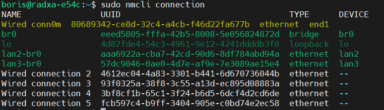

# Notes on Linux Bridges

Here we will create a temporary bridge between two ethernet ports with `iproute2` package (`ip a show` commands) and then make the same thing, but this time permanent with `nmcli` as a the `/etc/network/interfaces` method is a legacy one. Anyway an example with it will be shown.
Just have in mind that if a `nmcli`/`nmtui` is installed the recomended way is to do it with Network Manager package - `nmcli`.

## Hardware:

- RADXA E54C network computer

  ```bash title="uname -a"
  Linux radxa-e54c 6.1.84-6-rk2410 #6 SMP Fri Apr 18 09:22:57 UTC 2025 aarch64 GNU/Linux
  ```

  ```bash title="/etc/os-release"
    PRETTY_NAME="Debian GNU/Linux 12 (bookworm)"
    NAME="Debian GNU/Linux"
    VERSION_ID="12"
    VERSION="12 (bookworm)"
    VERSION_CODENAME=bookworm
    ID=debian
    HOME_URL="https://www.debian.org/"
    SUPPORT_URL="https://www.debian.org/support"
    BUG_REPORT_URL="https://bugs.debian.org/"

  ```

- Luckfox Pico pro/Max

  ```bash title="uname -a"
  Linux luckfox-bk 5.10.160 #1 Wed Jun 11 05:45:55 EEST 2025 armv7l GNU/Linux
  ```

  ```bash title="/etc/os-release"
    NAME=Buildroot
    VERSION=-gd2da6f0f4-dirty
    ID=buildroot
    VERSION_ID=2023.02.6
    PRETTY_NAME="Buildroot 2023.02.6"
  ```

- Windows PC with WiFi and Ethernet adapter

## Network Overview:

|  radxa   | windows |  luckfox  |   internet    |
| :------: | :-----: | :-------: | :-----------: |
|   WAN    |    -    |     -     |       -       |
|   LAN1   |    -    |     -     |       -       |
|   LAN2   |  ETH3   |     -     |       -       |
|   LAN3   |    -    |   ETH0    |       -       |
| USBDebug |   USB   |     -     |       -       |
|    -     |  ETH4   | USB RNDIS |       -       |
|    -     |  Wi-Fi  |     -     | Wi-Fi Network |

```
┌──────────┬────────────┬────────────┬──────────────┐
│  Radxa   │  Windows   │  Luckfox   │  Internet    │
├──────────┼────────────┼────────────┼──────────────┤
│ WAN      │            │            │              │
│ LAN1     │            │            │              │
│ LAN2─────┼─ETH3       │            │              │
│ LAN3─────┼────────────┼─ETH0       │              |
│ USBDebug─┼─USB        │            │              │
│          │ ETH4───────┼─USB RNDIS  │              │
│          │ Wi-Fi──────┼────────────┼─Wi-Fi Network│
└──────────┴────────────┴────────────┴──────────────┘
```

## Notes:

- Bridges are like switches, they operate at Layer 2 of the OSI model, they use MAC addresses.
- Routers operate at layer 3 IP addresses

That means devices connected to a bridge for example `eth1` deviceA and `eth2` deviceB will be able to communicate, **if they are on the same network**.

```
deviceA Windows Machine
ip: 172.16.1.10/24

deviceB Luckfox Pico Pro/Max
ip: 172.16.1.20/24
```

:::note[Clarification on CIDR notation]
10.10.10.0/24 is the network\
10.10.10.1/24 is the address
:::

## Tasks: 

0. [Prepare devices](#0-prepare-devices)
   - DeviceA, Windows Machine
   - DeviceB, Luckfox
1. [Create bridge on the host device between `eth1` and `eth2` (br0)](#1-create-bridge-on-the-host-device-between-eth1-and-eth2-call-it-br0)
2. [Connect deviceA to `eth1` and deviceB to `eth2`, set static IPs](#2-connect-devicea-to-eth1-and-deviceb-to-eht2-set-static-ips-in-network-172161024)
   - Checks
3. [Set an IP address for the bridge `br0`](#3-set-an-ip-address-of-the-bridge-br0-so-we-can-have-access-to-both-devices-from-the-host)
   - Checks
4. [Make things permanent legacy](#4-make-things-permanent-with-legacy-config)

5. [Make things permanent nmcli](#5-make-things-permanent-with-NetworkManager)

### 0. Prepare devices

#### RADXA

1.  Installing the needed packages

    1.1 Make sure you have internet connection

    :::note[sharing internet from Windows PC via Wi-Fi to Ethernet ]
    Go to WiFi adapter properties/Sharing/internetConnection sharing, mark the checkbox and select the network adapter to share with \
     Note the IP will be changed to `192.168.137.1` and a DHCP server will be active on this port, so make sure the RADXA ETH port is set to automatic ip address  
     :::
    1.2 Connect to the radxa via the USBDebug with putty and change the IP addres:

         - Open PuTTY and configure as follows:
         - Select Serial for connection type
         - Enter the COM port number in the Serial line field (check in device manager)
         - Set Speed to `1500000`
         - Select Serial for Connection type

    when connected use the already installed `nmtui` package to change the LAN2 adapter to automatic dhcp client \
     then get the ip of the radxa

    ```bash
    ip a show
    ```

    1.3 update package list

    ```bash
    sudo apt update
    ```

    1.4 search for the package, if already installed skip `apt install bridge-utils`

    :::note[bridge-utils obsolete]
    bridge-utils is obolete it is included in the iproute2 package and we will use iproute2 in the next steps
    :::

    ```bash
     radxa@radxa-e54c:~$ sudo apt search bridge-utils
     Sorting... Done
     Full Text Search... Done
     bridge-utils/stable,now 1.7.1-1 arm64 [installed]
     Utilities for configuring the Linux Ethernet bridge
    ```

    {/* 1.5 while still with PuTTY connection change the LAN2 ip address to `172.16.1.15` */}

#### DeviceA, Windows Machine

1. Go to Network Connections > `Win+R` type `ncpa.cpl` remove the sharing from the WiFi and set the ip address of the Ethernet Adapter connected to the Radxa to `172.16.1.10/24`

#### DeviceB, Luckfox

1.  [Install the buildroot OS on the spi flash](https://wiki.luckfox.com/Luckfox-Pico/Luckfox-Pico-RV1106/Luckfox-Pico-Pro-Max/Luckfox-Pico-Flash-burn-image)
2.  [Connect to it via the USB interface](https://wiki.luckfox.com/Luckfox-Pico/Luckfox-Pico-RV1106/Luckfox-Pico-Pro-Max/SSH-Telnet-Login)

    > When connecting Luckfox to the usb a virtual network port on the windows machine will be created\
    > USB virtual dongles have a **static** IP address of **172.32.0.93** Before using it, you need to set up the RNDIS virtual network port.\
    > Look for a Network Adapter with something like **_Remote NDIS based internet Sharing Device_** in the Network Connections.\
    > Change the address of the windows Network Adapter to: \
    > IP address: 172.32.0.100 \
    > subnet mask: 255.255.0.0

3.  Create a script in `/etc/init.d` check [this](https://wiki.luckfox.com/Luckfox-Pico/Luckfox-Pico-RV1103/Luckfox-Pico-Plus-Mini/Luckfox-Pico-Autostart) out \
    Why? \
     Buildroot with BusyBox init follows SysV-style init scripts for boot-time actions, hence changing /etc/network/interfaces won't work. \
     It runs at boot because BusyBox init uses `/etc/inittab` → runs `/etc/init.d/rcS` → runs all S\* scripts.

             3.1. Luckfox buildroot image is using [BusyBox](https://www.busybox.net/downloads/BusyBox.html) - The Swiss Army Knife of Embedded Linux\

        Create a startup script to wait 50 sec for dhcp server else set a static ip address

        - adjust the priority of system scripts

        ```bash title="/etc/init.d"
        mv S99usb0config S90usb0config
        mv S99_auto_reboot S90_auto_reboot
        ```

        - create a script `vi etc/init.d/S99_static_ip`

        ```bash title="/etc/init.d/S99_static_ip"
        #!/bin/sh

        echo "### Static IP script ###"

        MAX_RETRIES=10
        TRIES=0
        USER_IP=172.16.1.20/24

        check_ip_address(){
        if ip a show eth0 | grep -q "inet" ; then
                  echo "inet found"
                  return 0
             else
                  echo "inet not found"
             return 1
        fi
        }

        # check if we have ip by DHCP

        wait_dhcp() {
        while [ $TRIES -lt $MAX_RETRIES ]; do
             if check_ip_address ; then
                  echo "DHCP succeed!"
                  exit 0
             else
                  echo "$((TRIES + 1))/$MAX_RETRIES wait for DHCP IP..."
                  TRIES=$((TRIES + 1))
             sleep 5
             fi
        done
        }

        # set static IP

        set_static_ip() {
        echo "giving static IP $USER_IP"
        ip addr add $USER_IP dev eth0
        ip a show dev eth0
        }

        case $1 in
        check)
             check_ip_address
             ;;
        start)
             echo "start"
             wait_dhcp
             set_static_ip
             ;;
        stop)
             echo "stop"
             ;;
        \*)
             exit 1
             ;;
        esac

        ```

        - make the script executable

        ```bash
        chmod +x /etc/init.d/S99_static_ip
        ```

### 1. Create bridge on the host device (RADXA) between `lan2` and `lan3` call it `br0`

While connected with PuTTY

```bash title="add bridge device"
sudo ip link add name br0 type bridge
```

> see `man ip-link(8)`

```bash title="turn interfaces down"
sudo ip link set lan2 down
sudo ip link set lan3 down
```

```bash title="add interfaces to the bridge"
sudo ip link set lan2 master br0
sudo ip link set lan3 master br0
```

```bash title="check interfaces"
radxa@radxa-e54c:~$ sudo ip link
1: lo: <LOOPBACK,UP,LOWER_UP> mtu 65536 qdisc noqueue state UNKNOWN mode DEFAULT group default qlen 1000
    link/loopback 00:00:00:00:00:00 brd 00:00:00:00:00:00
2: end1: <BROADCAST,MULTICAST,UP,LOWER_UP> mtu 1508 qdisc mq state UP mode DEFAULT group default qlen 1000
    link/ether 46:ed:77:9f:2f:81 brd ff:ff:ff:ff:ff:ff
3: lan3@end1: <BROADCAST,MULTICAST> mtu 1500 qdisc noqueue master br0 state DOWN mode DEFAULT group default qlen 1000
    link/ether 00:48:54:20:00:03 brd ff:ff:ff:ff:ff:ff
4: lan2@end1: <BROADCAST,MULTICAST> mtu 1500 qdisc noqueue master br0 state DOWN mode DEFAULT group default qlen 1000
    link/ether 00:48:54:20:00:02 brd ff:ff:ff:ff:ff:ff
5: lan1@end1: <BROADCAST,MULTICAST> mtu 1500 qdisc noqueue state DOWN mode DEFAULT group default qlen 1000
    link/ether 00:48:54:20:00:01 brd ff:ff:ff:ff:ff:ff
6: wan@end1: <NO-CARRIER,BROADCAST,MULTICAST,UP> mtu 1500 qdisc noqueue state LOWERLAYERDOWN mode DEFAULT group default qlen 1000
    link/ether 00:48:54:20:00:00 brd ff:ff:ff:ff:ff:ff
7: br0: <BROADCAST,MULTICAST> mtu 1500 qdisc noqueue state DOWN mode DEFAULT group default qlen 1000
    link/ether ba:37:11:86:dd:71 brd ff:ff:ff:ff:ff:ff

```

We can see that `3: lan3` and `4: lan2` are with master `7: br0` \
Another way is to check with `bridge` command:

```bash title="check bridged interfaces"
radxa@radxa-e54c:~$ sudo bridge link
3: lan3@end1: <BROADCAST,MULTICAST> mtu 1500 master br0 state disabled priority 32 cost 19
4: lan2@end1: <BROADCAST,MULTICAST> mtu 1500 master br0 state disabled priority 32 cost 19
```

```bash title="bring interfaces up"
sudo ip link set lan2 up
sudo ip link set lan3 up
sudo ip link set br0 up
```

### 2. Connect deviceA to `eth1` and deviceB to `eht2` set static IPs in network 172.16.1.0/24

At this step we have already configured the adresses of the luckfox `172.16.1.20/24` and the windows PC `172.16.1.10/24`, time to check the bridge

#### Checks

1. Check connectivity from deviceA to deviceB and vice versa

```powershell title="windows PC -> luckfox"
PS C:\Users\kolev> ping  172.16.1.20

Pinging 172.16.1.20 with 32 bytes of data:
Reply from 172.16.1.20: bytes=32 time=2ms TTL=64
Reply from 172.16.1.20: bytes=32 time=2ms TTL=64
Reply from 172.16.1.20: bytes=32 time=2ms TTL=64
Reply from 172.16.1.20: bytes=32 time=2ms TTL=64

Ping statistics for 172.16.1.20:
    Packets: Sent = 4, Received = 4, Lost = 0 (0% loss),
Approximate round trip times in milli-seconds:
    Minimum = 2ms, Maximum = 2ms, Average = 2ms
```

Using the virtual network with RNDIS connection coonect from pc to luckfox `root@172.32.0.93` and chek the `luckfox eth0` interface connection

```bash title="luckfox -> windows PC"
[root@luckfox-bk root]# ping 172.16.1.10
PING 172.16.1.10 (172.16.1.10): 56 data bytes
64 bytes from 172.16.1.10: seq=0 ttl=128 time=2.769 ms
64 bytes from 172.16.1.10: seq=1 ttl=128 time=2.822 ms
64 bytes from 172.16.1.10: seq=2 ttl=128 time=3.113 ms
64 bytes from 172.16.1.10: seq=3 ttl=128 time=2.698 ms
64 bytes from 172.16.1.10: seq=4 ttl=128 time=2.893 ms
64 bytes from 172.16.1.10: seq=5 ttl=128 time=2.785 ms
^C
--- 172.16.1.10 ping statistics ---
6 packets transmitted, 6 packets received, 0% packet loss
round-trip min/avg/max = 2.698/2.846/3.113 ms
```

Now we can try to log to the luckfox from the address `172.16.1.20`

```powershell title="login to luckfox through ethernet interface "
PS C:\Users\kolev> ssh   root@172.16.1.20
The authenticity of host '172.16.1.20 (172.16.1.20)' can't be established.
ED25519 key fingerprint is SHA256:sGpar00ySOKpakv4SxHZ806d4xRdOeFr/8DyH/YF05I.
This host key is known by the following other names/addresses:
    C:\Users\kolev/.ssh/known_hosts:55: 172.32.0.93
Are you sure you want to continue connecting (yes/no/[fingerprint])? yes
Warning: Permanently added '172.16.1.20' (ED25519) to the list of known hosts.
root@172.16.1.20's password:
[root@luckfox-bk root]# ip a
1: lo: <LOOPBACK,UP,LOWER_UP> mtu 65536 qdisc noqueue qlen 1000
    link/loopback 00:00:00:00:00:00 brd 00:00:00:00:00:00
    inet 127.0.0.1/8 scope host lo
       valid_lft forever preferred_lft forever
2: eth0: <BROADCAST,MULTICAST,UP,LOWER_UP> mtu 1500 qdisc mq qlen 1000
    link/ether fe:39:bd:06:be:63 brd ff:ff:ff:ff:ff:ff
    inet 172.16.1.20/24 scope global eth0
       valid_lft forever preferred_lft forever
3: usb0: <BROADCAST,MULTICAST,UP,LOWER_UP> mtu 1500 qdisc pfifo_fast qlen 1000
    link/ether 36:02:64:2b:3f:8a brd ff:ff:ff:ff:ff:ff
    inet 172.32.0.93/16 brd 172.32.255.255 scope global usb0
       valid_lft forever preferred_lft forever
```

### 3. Set an ip address of the bridge br0 so we can have access to both devices from the host

```bash title="set ip of br0"
sudo ip address add 172.16.1.1/24 dev br0
```

```bash title=check ip of br0"
boris@radxa-e54c:~$ ip a show br0
7: br0: <BROADCAST,MULTICAST,UP,LOWER_UP> mtu 1500 qdisc noqueue state UP group default qlen 1000
    link/ether ba:37:11:86:dd:71 brd ff:ff:ff:ff:ff:ff
    inet 172.16.1.1/24 scope global br0
       valid_lft forever preferred_lft forever
    inet6 fe80::b837:11ff:fe86:dd71/64 scope link
       valid_lft forever preferred_lft forever
```

#### Checks

1. Check connection to Windows PC from bridge host (radxa) and vice versa

   > host bridge (br0) `172.16.1.1` ping windows machine `172.16.1.10` \
   > \
   > windows `172.16.1.10` ping to br0 `172.16.1.1` \
   > 

2. Check connection to luckfox pico from bridge host (radxa) and vice versa
   > host bridge (br0) `172.16.1.1` check ping to luckfox `172.16.1.20` \
   >  \
   > luckfox `172.16.1.20` check ping to br0 `172.16.1.1` \
   > 

### 4. Make things permanent with legacy config

Edit the file with something similiar

```bash title='/etc/network/interfaces'
# Loopback interface
auto lo
iface lo inet loopback

# Define the bridge interface
auto br0
iface br0 inet static
    address 172.16.1.1
    bridge_ports lan2 lan3
    bridge_stp off           # disable spanning tree protocol
    bridge_fd 0              # no forwarding delay
    bridge_maxwait 0         # no delay before bridge comes up
```

:::note
not tested
:::

### 5. Make things permanent with NetworkManager

All good but with `iproute2` (commands shown above `ip a show` etc.) everything is valid until next reboot so we will have to do the whole thing again. This time using the nmcli/nmtui
I preffer the `nmcli`. So first it is good to reboot the system and start a fresh.

#### 5.1 Create a bridge `br0`

```bash title="nmcli create bridge"
nmcli connection add type bridge autoconnect yes con-name br0 ifname br0
```

#### 5.2 Add the connections `lan2` and `lan3` to the bridge

```bash title="nmcli add bridge-slave"
nmcli connection add type bridge-slave autoconnect yes con-name lan2-br0 ifname lan2 master br0 && \
nmcli connection add type bridge-slave autoconnect yes con-name lan3-br0 ifname lan3 master br0
```

#### 5.3 Assign an ip to the `br0`

```bash title="nmcli assign IP to br0"
nmcli connection modify br0 ipv4.addresses 172.16.1.1/24 && \
nmcli connection mofify br0 ipv4.method manual
```

#### 5.4 Bring everything up

```bash title="nmcli connections up"
nmcli connection up lan2-br0 && \
nmcli connection up lan3-br0
nmcli connection up br0
```

#### 5.5 Make the tests

```bash title="nmcli connections"
nmcli connection
```

if you see them in green all good


Feel free to observe other commands of `nmcli`, you can aslo use the `nmtui` ternimal user interface which is quite neat but for simple things

#### 5.6 Stop the bridge

If you are not happy with the bridge or the configuration you want is now different just make the connection down, and lan2 and lan3 will be separe again with prev. settings

```bash title="connection down"
sudo nmcli connection down br0
```

As you can see devices `lan2` and `lan3` are now with names Wired conneciton 3 / Wired connection 4

