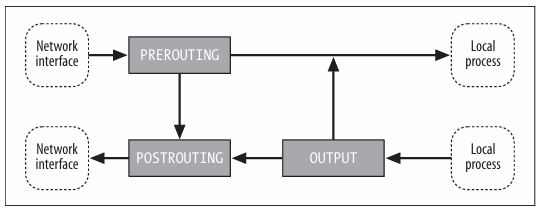
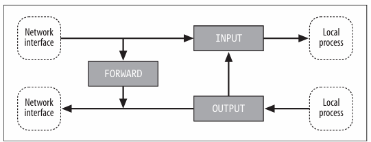
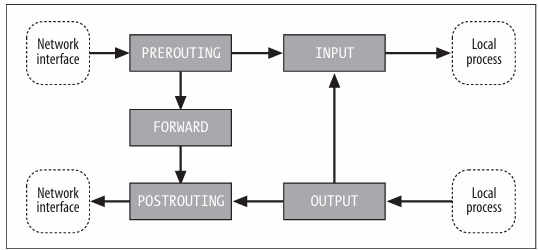

# Iptables

## Main Tables

The main tables represents the the types of processing that can be done on a packet. The main tables are:

- `nat` - Network Address Translation
- `filter` - Packet filtering
- `mangle` - Packet alteration

There are five main hookpoints "chains" are:
`PREROUTING`, `INPUT`, `FORWARD`, `OUTPUT`, `POSTROUTING`

### NAT



Used with connection tracking to redirect connections for network
address translation; typically based on source or destination addresses.
Its built-in chains are: `OUTPUT`, `POSTROUTING`, and `PREROUTING`

### Filter


Used to set policies for the type of traffic allowed into,through,and out of
the computer. Unless you refer to a different table explicitly, iptables
operate on chains within this table by default. Its built-in chains are:
`FORWARD`,`INPUT`, and `OUTPUT`

### Mangle



Used for specialized packet alteration, such as stripping off IP options (as
with the IPV4OPTSSTRIP target extension). Its built-in chains are:
`FORWARD`,`INPUT`,`OUTPUT`,`POSTROUTING`, and `PREROUTING`

## Basic syntax

```bash
iptables [table] [action] [chain] [matching criteria] [target]
```

```bash title="Example"
sudo iptables -t filter -A INPUT -p tcp --dport 80 -j ACCEPT
```

Append to the INPUT chain in the filter table a rule that accepts all TCP packets destined for port 80.

:::note
`-t` specifies the table to use (default is `filter`)
:::

### Tables

     - **filter**: the default table, which is used for packet filtering
     - **nat**: used for network address translation
     - **mangle**: used for specialized packet alteration
     - **raw**: used for configuring exemptions from connection tracking
     - **security**: used for Mandatory Access Control (MAC) rules

### Chains

     - **INPUT**: packets destined for the local sockets
     - **FORWARD**: packets routed through the host system
     - **OUTPUT**: packets generated by the host system (localy genertated packets)
     - **PREROUTING**: altering packets as soon as they come in
     - **POSTROUTING**: altering packets as they are about to leave

:::note
Each CHAIN has its own default policies (ACCEPT/DROP/REJECT), which can be set using the `-P` option.
:::

### Targets

     - **ACCEPT**: allow the packet to pass
     - **DROP**: silently discard the packet
     - **REJECT**: discard the packet and send an error message back to the sorce (sender)
     - **LOG**: log the packet details and **continue** processing
     - **RETURN**: stop processing the current chain and return to the calling chain
     - **QUEUE**: pass the packet to a user-space application
     - **REDIRECT**: redirect the packet to a local socket (another port or address)

### Matching Criteria

     - **-p**: protocol
     - **-s**: source address
     - **-d**: destination address
     - **-i**: input interface
     - **-o**: output interface
     - **-m**: match extension
     - **-j**: target extension

### Match extensions

     - **--state**: match connection state
     - **--sport**: match source port
     - **--dport**: match destination port
     - **--icmp-type**: match ICMP type
     - **--limit**: match rate limiting
          `-m limit --limit 5/minute`
     - **--log-prefix**: log message prefix
     - **--log-level**: log message level
     - **--comment**: add a comment to the rule
          `-m comment --comment "This is a comment"`
     - **conntrack**: match connection tracking state
          `-m conntrack --ctstate ESTABLISHED,RELATED`

## Connection Tracking

Connection states recognized by the connection tracking system are:

- **NEW**: the first packet of a connection
- **ESTABLISHED**: packets that are part of an existing connection
- **RELATED**: packets that **start** a new connection but are **associated with** an existing connection
- **INVALID**: packets that don't belong to any known connection

### Stateless

Decisions are mare solely based on the information contained within the induvidual packet, such as source/destination IP addresses, ports, and protocol.

pros:

- simple
- fast (lower memory and processing requirements)

cons:

- less secure, as it can't detect certain types of attacks
- requires more complex rules to achieve the same level of security

Example:

```bash
iptables -A INPUT -p tcp --dport 80 -j ACCEPT
```

> This rule allows all incoming TCP packets destined for port 80 regardless of the connection state.

### Stateful

It can distinguish between new connections and those that are part of existing, established connections.

pros:

- more secure
- simpler rules, as the connection tracking system maintains the state of each connection
- better support for complex protocols

cons:

- higher memory and processing requirements
- more complex to implement and troubleshoot

Example:

```bash
iptables -A INPUT -m conntrack --ctstate NEW -p tcp --dport 80 -j ACCEPT
iptables -A INPUT -m conntrack --ctstate ESTABLISHED,RELATED -j ACCEPT
```

> The first rule allows all incoming TCP packets destined for port 80 that are part of a new connection. The second rule allows all incoming packets that are part of an established or related connection.

## Save and Restore Rules

The `iptables-persistent` package on Debian/Ubuntu provides tools like `iptables-save` and `iptables-restore` for saving and restoring firewall rules.

```bash
sudo apt update
sudo apt install iptables-persistent
```

```bash title="Save rules"
sudo iptables-save > /etc/iptables/rules.v4
```

```bash title="Restore rules"
sudo iptables-restore < /etc/iptables/rules.v4
```

## Basic Examples

### Logging

#### Basic Logging

```bash
sudo iptables -A INPUT -j LOG --log-prefix "Dropped packet: " --log-level 7
```

> this will log all incoming packets

#### Advanced Logging

```bash
sudo iptables -A INPUT -m limit --limit 5/minute -j LOG --log-prefix "Dropped packet: " --log-level 7
```

> this rule limits the logging to 5 messages per minute to prevent log flooding

#### combining with DROP

```bash
sudo iptables -A INPUT -j LOG --log-prefix "iptables DROP: " --log-level 7
sudo iptables -A INPUT -j DROP
```

> this will log all incoming packets, before actually dropping them

#### log-level

- **0**: emerg, something is going very wrong
- **1**: alert, immediate action is required
- **2**: crit, critical hardware or software failure
- **3**: err, usuallty hardware problems of drivers
- **4**: warning, something is not right, but not critical
- **5**: notice, normal but significant events
- **6**: info, normal operational messages
- **7**: debug, debugging messages

### Live monitoring

```bash
watch -n 1 "sudo iptables -L DOCKER-USER -v -n --line-numbers"
```

> this will show the rules in the DOCKER-USER chain every second

### Read Logs of traffic monitoring

```bash title="log monitoring directrly from kernel ring buffer"
sudo dmesg -H | grep iptables
```

```bash title="log monitoring using journalctl -k (kernel)"
 sudo journalctl -k | grep -i DROP
```

### WIREGUARD

You can use `PostUp` and `PostDown` in wireguard config file.

```bash
# Note use this configuration file with > wg-quick wg0

[Interface]
PrivateKey = yourprivatekey
# PublicKey = RV6uxHOGhZVIPBdo3pP7hRmi5UfvgCx7NKDssTv6eFY=
Address = 10.10.10.1/24
ListenPort = 51820

#PostUp   = iptables -A FORWARD -i %i -j ACCEPT; iptables -A FORWARD -o %i -j ACCEPT; iptables -t nat -A POSTROUTING -o eth0 -j MASQUERADE
#PostDown = iptables -D FORWARD -i %i -j ACCEPT; iptables -D FORWARD -o %i -j ACCEPT; iptables -t nat -D POSTROUTING -o eth0 -j MASQUERADE

[Peer]

# Boris Legion
PublicKey = Ldu78bq6gedehTUSG4Cp3khV7xpSkVtpsJA3ytT0P0Y=
AllowedIPs = 10.10.10.2/32
```

In general you have to:

1. `MASQUERADE` the output interface traffic with source address from `WG` network 10.10.10.0/24, all this in the `POSTROUTING` chain

```bash
sudo iptables -t nat -A POSTROUTING -o eth0 -s 10.10.10.0/24 -j MASQUERADE
```

2. `ACCEPT` the traffic from input interce -> output interface and vice versa

```bash
sudo iptables  -A FORWARD -i eth0 -o wg0 -j ACCEPT
```

3.

```bash
sudo iptables  -A FORWARD -i wg0 -o eth0  -s 10.10.10.0/24 -j ACCEPT
```

:::warning
if you have Docker installed and have a DROP policy things in step 2. and 3. are done in DOCKER-USER chain
:::

### DOCKER

### simple bash scripts

## NAT

### SNAT

SNAT is used when you want to change the source IP address of packets leaving your network. This is commonly when you have
a private network behind a firewall and want all outgoing traffic to appear as if it's coming from a single public IP address.

```bash title="SNAT"
sudo iptables -t nat -A POSTROUTING -o eth0 -j SNAT --to-source 200.0.113.5
```

### MASQUERADE

Masquareding is a form of dynamic SNAT that automatically changes the source IP address of packets leaving your network to the IP address of the outgoing interface.

```bash title="MASQUERADE"
sudo iptables -t nat -A POSTROUTING -o eth0 -j MASQUERADE
```

> this rule is similar to the SNAT rule, but instead of specifying a static IP address, we use the MASQUERADE target, which automatically uses the current IP address of the outgoing interface.

### DNAT

DNAT is used to change the destination address of packets coming into your network. This is commonly used for port forwarding, where incoming traffic to a specific port is redirected toa different IP address and port on the internal network.

```bash title="DNAT"
sudo iptables -t nat -A PREROUTING -i eth0 -p tcp --dport 80 -j DNAT --to-destination 192.168.200.5:8080
```

## References

1. [Linux iptables Pocket Reference, Gregor N. Purdy O'Reilly Media, Inc.](https://www.oreilly.com/library/view/linux-iptables-pocket/9780596801861/)
2. [Linux Firewall, Cloudmatrix S.R.O.](https://a.co/d/2G43Iu1)
