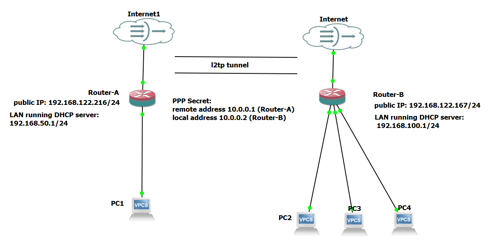

# L2tp server

:::caution
not yet tested
:::

## Starting point

This is run on a simulated GNS3 environement set as follows:


The goal is to create a site-to-site tunnel connection between the two sites, where the server has a static real IP and the client is not obligated to have static IP.
:::note[without IPSec]
This example does not use IPSec so the tunnel will not be encrypted.
:::

### start the l2tp server

```
[admin@MikroTik] > /interface l2tp-server server set enabled=yes
[admin@MikroTik] > /ppp secret add local-address=10.0.0.2 name=MT-User password=StrongPass profile=default-encryption remote-address=10.0.0.1 service=l2tp
```

where:
local-address is Router B
remote-address is router A

### start the l2tp client

```
[admin@MikroTik] > /interface l2tp-client \
add connect-to=192.168.51.3 disabled=no name=MT-User password=StrongPass user=MT-User
```

where:

- connect-to=192.168.51.3 is the server real static ip address

```
[admin@MikroTik] > /interface l2tp-client print
Flags: X - disabled, R - running
0 R name="MT-User" max-mtu=1450 max-mru=1450 mrru=disabled connect-to=192.168.51.3 user="MT-User"
password="StrongPass" profile=default-encryption keepalive-timeout=60 use-ipsec=no ipsec-secret=""
allow-fast-path=no add-default-route=no dial-on-demand=no allow=pap,chap,mschap1,mschap2
```

## firewall rule to enable udp for l2tp

```
/ip firewall filter
add action=accept chain=input comment="allow udp ltp2" dst-port=1701 in-interface=ether1 protocol=udp
```

## add a routes for site to site connection

### Router-B

```
/ip route
add distance=1 dst-address=192.168.100.0/24 gateway=10.0.0.1
```

where:

- dst-address is the local network of Router-B
- gateway is the remote-address given in the ppp secret

### Router-B

```
/ip route
add distance=1 dst-address=192.168.50.0/24 gateway=10.0.0.2
```

where:

- dst-address is the local network of Router-A
- gateway is the local-address given in the ppp secret

## Disable/ stop l2tp client

disabling PPP Secret does not disconnect the current session, it only prevents new login so it is not enough.

### step 1 Disable PPP Secret

```
/ppp secret set remoteSite  disabled=yes
```

### step 2 Stop active session

```
/ppp active print
/ppp active remove [connection number]
```

