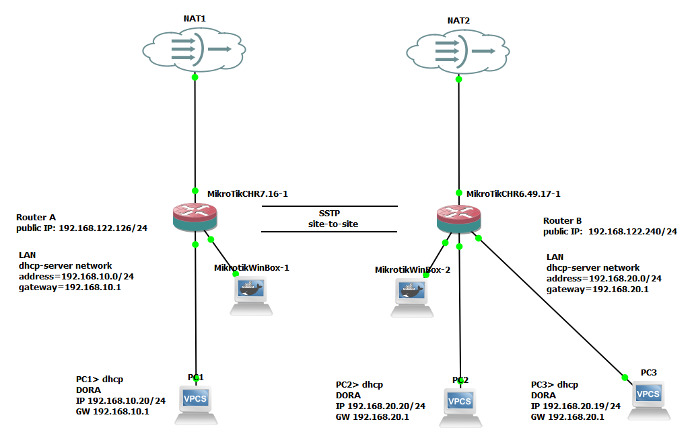

## sstp site-to-site vpn



```bash
server 
   create bridge 
      [admin@MikroTik] > /interface bridge add name=LAN
      [admin@MikroTik] > /interface bridge port add bridge=LAN interface=ether2
      [admin@MikroTik] > /interface bridge port add bridge=LAN interface=ether3
      [admin@MikroTik] > /interface bridge port add bridge=LAN interface=ether4
   prepare dhcp server for LAN bridge
      create dhcp pool
	     [admin@MikroTik] > /ip pool add name=dhcp-pool ranges=192.168.10.10-192.168.10.20
      add dhcp-server
	     [admin@MikroTik] > /ip dhcp-server add address-pool=dhcp-pool interface=LAN name=dhcp1
	  add ip address
	     [admin@MikroTik] > /ip address add address=192.168.10.1/24 interface=LAN network=192.168.10.0
      add dhcp-serer network
	     [admin@MikroTik] > /ip dhcp-server network add address=192.168.10.0/24 gateway=192.168.10.1
      add Masquarade firewall
	     [admin@MikroTik] >  /ip firewall nat add chain=srcnat action=masquerade out-interface=ether1

   create a ppp secret 
         [admin@MikroTik] > /ppp secret add local-address=10.0.0.1 name=MT-User password=StrongPass remote-address=10.0.0.5 service=sstp
   setup the interface 
         [admin@MikroTik] > /interface sstp-server server set default-profile=default-encryption enabled=yes
   add routes to remote-address
         [admin@MikroTik] > /ip route add distance=1 dst-address=192.168.20.0/24 gateway=10.0.0.5


```

```
client 
   create bridge 
      [admin@MikroTik] > /interface bridge add name=LAN
      [admin@MikroTik] > /interface bridge port add bridge=LAN interface=ether2
      [admin@MikroTik] > /interface bridge port add bridge=LAN interface=ether3
      [admin@MikroTik] > /interface bridge port add bridge=LAN interface=ether4
   prepare dhcp server for LAN bridge
      create dhcp pool
	     [admin@MikroTik] > /ip pool add name=dhcp-pool ranges=192.168.20.10-192.168.20.20
      add dhcp-server
	     [admin@MikroTik] > /ip dhcp-server add address-pool=dhcp-pool interface=LAN name=dhcp1
	  add ip address
	     [admin@MikroTik] > /ip address add address=192.168.20.1/24 interface=LAN network=192.168.20.0
      add dhcp-serer network
	     [admin@MikroTik] > /ip dhcp-server network add address=192.168.20.0/24 gateway=192.168.20.1
      add Masquarade firewall
	     [admin@MikroTik] >  /ip firewall nat add chain=srcnat action=masquerade out-interface=ether1
   prepare the sstp-client
         [admin@MikroTik] > /interface sstp-client add connect-to=192.168.122.126 disabled=no name=sstp-out1 password=StrongPass profile=default-encryption user=MT-User
   add routes to remote-address
         [admin@MikroTik] > /ip route add distance=1 dst-address=192.168.20.0/24 gateway=10.0.0.1
```

```
Tests:
SERVER
   [admin@MikroTik] > /interface/ sstp-server/ monitor
numbers: 0
		  status: connected
		  uptime: 1m13s
			user: MT-User
	   caller-id: 192.168.122.240
		encoding: AES256-CBC
			 mtu: 1500
   local-address: 10.0.0.1
  remote-address: 10.0.0.5
CLIENT  
[admin@MikroTik] > /interface sstp-client monitor
numbers: 0
          status: connected
          uptime: 5m54s
        encoding: AES256-CBC
             mtu: 1500
   local-address: 10.0.0.5
  remote-address: 10.0.0.1

   [admin@MikroTik] > /interface sstp-client print
Flags: X - disabled, R - running
 0  R name="sstp-out1" max-mtu=1500 max-mru=1500 mrru=disabled connect-to=192.168.122.126:443 http-proxy=0.0.0.0:443
      certificate=none verify-server-certificate=no verify-server-address-from-certificate=yes user="MT-User"
      password="StrongPass" profile=default-encryption keepalive-timeout=60 add-default-route=no dial-on-demand=no
      authentication=pap,chap,mschap1,mschap2 pfs=no tls-version=any
```